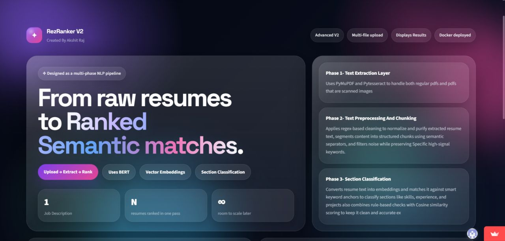
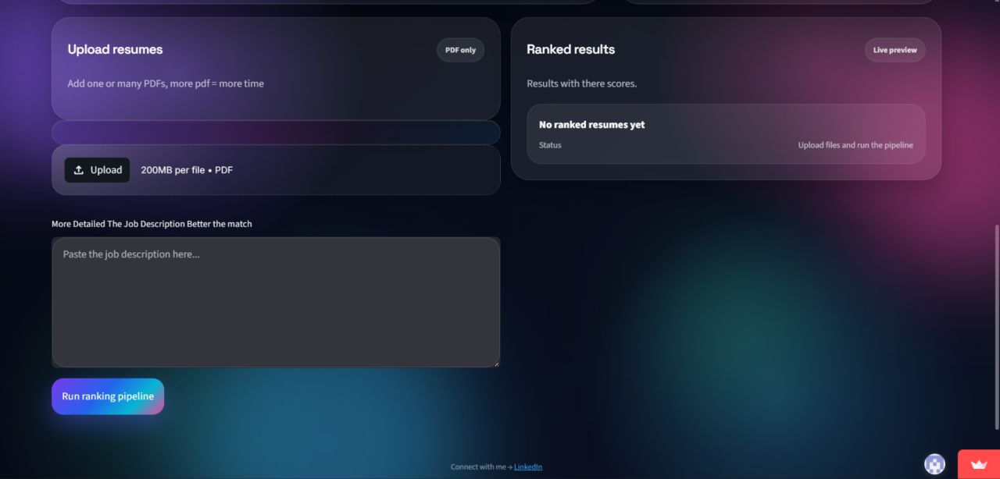

# RezRanker V2

RezRanker V2 is a semantic resume ranking system that compares multiple resumes against a job description using sentence embeddings, cosine similarity, section-aware scoring, and a deployable Streamlit interface. Instead of relying on raw keyword matching, it tries to understand whether a resume is relevant in meaning, then ranks candidates accordingly.
## UI Preview

Upload multiple resumes and paste the job description.

Ranked results with scores and visual bars.

## weblink(yes its streamlit but pretty)- https://lnkd.in/gyuFcEDF

## Video Explanation of whole backend (YT)- https://lnkd.in/gKpNN-cT

---

## What This Project Does

Given:

- one job description
- multiple resume PDFs

the system:

1. extracts text from each resume
2. cleans and chunks the text
3. classifies chunks into sections such as skills, experience, education, and projects
4. compares those sections with the job description using `all-mpnet-base-v2`
5. produces a final relevance score
6. ranks all resumes from best match to worst match

This makes the project more meaningful than a plain keyword counter because it compares semantic similarity, not just exact word overlap.

---

## Project Structure

RezRanker-V2/  
│  
├── app.py  
├── main.py  
├── comparison.py  
├── text_extraction.py  
└── text_preprocess.py

---

## File-by-File Breakdown

### `app.py`

This is the Streamlit frontend and orchestration layer.

It handles:

- PDF uploads
- job description input
- looping through resumes
- calling the ranking pipeline
- sorting results
- showing rankings in the UI
- exporting CSV output

This file turns the model pipeline into an actual usable product instead of just a notebook experiment.

### `main.py`

This file contains the main `forward_pass()` logic.

It:

- cleans the job description
- preprocesses the resume
- classifies resume content into sections
- calculates a section-aware score
- calculates a full-resume fallback score
- combines them into the final score

This is the control center of the ranking pipeline.

### `comparison.py`

This file computes semantic similarity between the job description and the classified resume sections.

It:

- embeds each section separately
- creates JD variants with skills-focus and experience-focus
- computes similarity scores for each section
- dynamically adjusts section weights
- returns one final section-based score

This is the scoring engine of the project.

### `text_extraction.py`

This file extracts text from PDF resumes.

It uses:

- **PyMuPDF** for text-based PDFs
- **pytesseract OCR** for scanned or image-only pages

That makes the system much more practical because it can work on both clean PDFs and scanned resumes.

### `text_preprocess.py`

This file contains the structural intelligence of the project.

It handles:

- regex-based cleanup
- chunk splitting
- filtering noisy chunks
- merging useful short chunks
- section classification
- job-description cleaning
- domain detection from the JD

This is where raw resume text starts becoming structured, rankable data.

---

## Pipeline Structure

Resume PDF(s)  
   ↓  
Text Extraction  
   ↓  
Cleaning + Chunking  
   ↓  
Section Classification  
   ↓  
JD Cleaning + Embedding  
   ↓  
Section-wise Semantic Comparison  
   ↓  
Fallback Whole-Resume Similarity  
   ↓  
Final Weighted Score  
   ↓  
Ranking + Streamlit Display

---

## How the Pipeline Works

### 1. Text Extraction

The system opens each uploaded PDF and tries to read text directly. If a page has no readable text, it converts the page into an image and runs OCR on it. This is a strong design choice because real resumes are often inconsistent in format.

### 2. Cleaning and Chunking

The extracted resume text is cleaned using regex, lowercased, split into chunks, filtered for useless fragments, and merged when short chunks likely belong together. This improves embedding quality because the model receives cleaner and more meaningful units instead of broken text fragments.

### 3. Section Classification

Chunks are classified into:

- skills
- experience
- education
- project

The classifier uses a hybrid approach:

- rule-based detection for obvious section headers
- semantic anchor matching using embeddings
- JD-based domain detection to adapt anchors for frontend, backend, ML, and devops roles

This is one of the most interesting parts of the project because it combines heuristics with embedding-based logic instead of depending on only one method.

### 4. Semantic Comparison

Each section is embedded and compared with the job description using cosine similarity. The JD is also slightly refocused depending on whether the system is scoring skills or experience. That makes the comparison more targeted.

### 5. Final Score Formation

The system calculates:

- a section-based score
- a full-resume fallback score

Then it blends them. If too many sections are empty, it falls back more heavily on the whole-resume score. This makes the pipeline more robust against weak section classification.

---

## Most Impressive Parts of the Project

## 1. Hybrid PDF Extraction

The project does not break on scanned resumes.

It uses:

- direct text extraction when possible
- OCR fallback when necessary

That makes it much more realistic than simple student projects that only work on perfectly readable PDFs.

## 2. Semantic Ranking Instead of Keyword Counting

The core ranking is based on `all-mpnet-base-v2` embeddings and cosine similarity, not just manual keyword overlap. That is important because relevant resumes do not always use the exact same words as the job description.

## 3. Section-Aware Resume Understanding

The project does not treat the entire resume as one blob immediately. It tries to separate skills, experience, education, and projects before scoring. That gives the system more structure and makes the scoring logic feel closer to how an actual recruiter reads resumes.

## 4. JD-Based Domain Adaptation

The section classifier first detects whether the job description is more aligned with:

- frontend
- backend
- ML
- devops

Then it enriches the anchors used for section classification based on that detected domain. This is a genuinely good touch because it makes the classifier more adaptive instead of fully generic.

## 5. Dynamic Section Weighting

The score is not built from rigid fixed weights only. Section weights are adjusted based on how relevant each section is to the JD. That means stronger candidate signals naturally influence the final score more.

## 6. Fallback Safety Logic

The project does not blindly trust section classification. If too many sections are empty, it shifts to the whole-resume similarity score. This makes the pipeline more stable on badly formatted resumes.

## 7. End-to-End Product Shape

This is not only a backend model. It is a complete mini product with:

- multi-file input
- scoring
- ranked display
- CSV export
- deployable Streamlit UI

That makes it much stronger for internship presentation because it shows both ML pipeline thinking and application-level integration.

---

## Why the Project Stands Out

What makes RezRanker V2 interesting is not just that it ranks resumes, but how it does it:

- it handles messy real-world PDFs
- it converts raw text into structured sections
- it uses semantic embeddings instead of shallow keyword counts
- it adapts section logic based on the job domain
- it blends precision scoring with fallback robustness
- it is packaged as a usable application

That combination makes the project look more thoughtful and more complete than a basic resume screener.

---

## Tech Stack

- Python
- Streamlit
- Sentence Transformers
- `all-mpnet-base-v2`
- scikit-learn
- NumPy
- PyMuPDF
- pytesseract
- PIL

# Results-
**SpearmanRank(old)=0.59** 
SpearmanRank(New)=0.62 (looks small but in spearman terms thats significant) 81 % accuracy 

Why its not perfect (Yet)- 

1) The model All-Mpnet-base-v2 (vanilla) is a general sentence embedding model and does not understand difference b/w domains ex- Can distinguish b/w tech and non tech resumes by itself... needs fine tuning.

 
2) Haven't Implemented skill importance weighting Ex- Python is treated same as time management skill.

3)The Chunking noise problem, the resume chunks despite alot of preprocessing is still not perfect and contain noise.

Thats V2 👇
(Took the most amount of work till yet)
